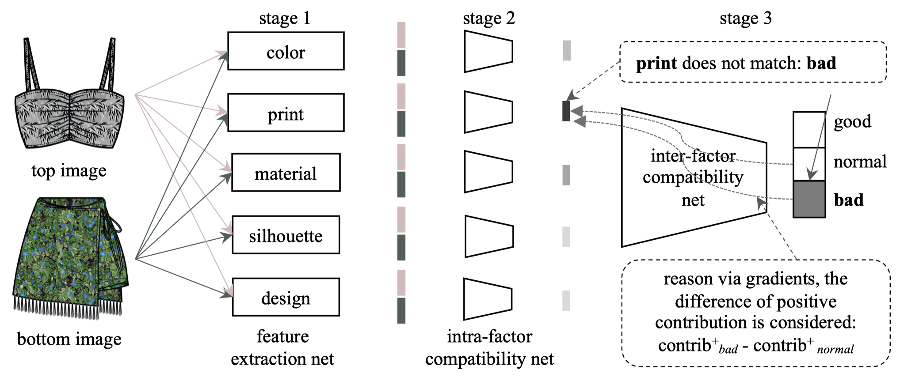

在关于时尚服饰搭配性的研究中，通常使用基于度量学习的方式。把不同的服饰特征嵌入到一个特征空间中，相搭的服饰在特征空间中距离更近。但是一个常见的搭配并不一定是一个“好”的搭配，可能仅仅是普通的。

<!--more-->

在此论文中主要研究科解释性的服饰搭配任务。给定一套服饰组合，首先提取颜色、材质、轮廓和设计细节等因素的特征向量，然后对其中每种因素生成一个单独的兼容性特征，然后将所有兼容性特征合并输入到总体的兼容性网络中。并且可以通过根据梯度来回溯，判断其中不同因素带来的影响。同时训练中还增加了梯度惩罚，使得追溯到的原因可以和数据标签相同。

## 数据集

论文根据其任务收集了包含这样一些元数据标签的数据集 EVALUATION3，此数据集基于Polyvore outfit 数据集构建共包含18108组服饰，但是没有包含全部服饰类别，每一个样本只包含一对上装和下装。同时论文中还提出使用三个评级，不好，普通，好来区分样本。不好的样本中包含某个因素的明显错误，比如不合适的颜色搭配，好的样本包含一些特别的设计，比如特殊的剪裁。

## 网络结构

网络结构主要分为三个部分：

1. **Fashion feature extraction:** 使用ImageNet预训练的ResNet-18作为特征提取器，然后在有各种类别数据标注的EVALUATION3 数据集上训练四个不同的分类器，预测结果为分别对应数据集中Print, material, sihouette, design的若干类别的向量。对于颜色采用了特殊的Fashion Color System[^1]方法从颜色分布直方图获取25维的特征。
2. **Intra-factor compatibility network:** 把一堆样本（一件上装和一件下装）的不同因素的特征向量经过三个FC层，得到5个融合后的特征，concat之后作为下一步的输入。
3. **Inter-factor compatibility network:** 以前一步的输出再进过三个FC层，得到最终预测结果，包含三种标签并计算交叉墒损失。

## 可解释性判断

`//TODO`

